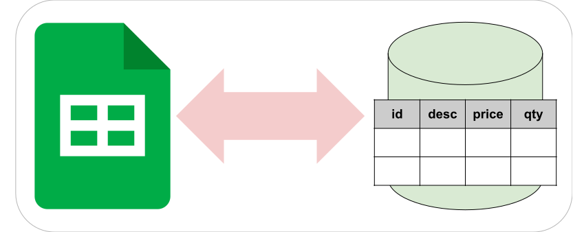
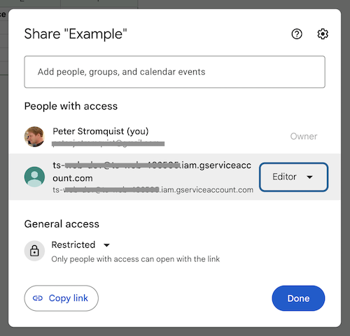
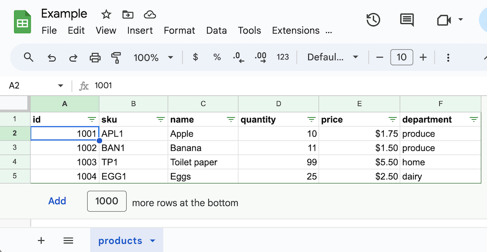

# google-sheets-table




[](https://github.com/twistedstream/google-sheets-table/actions)

[](https://opensource.org/licenses/MIT)

Treat a Google Sheet like a database table.

## Motivation

For simple projects, you often don't have the time (or the patience) to build a full admin backend for your app. A [Google Sheets document](https://www.google.com/sheets/about/) makes an ideal backend for these situations because:

- You don't have to build an admin UI
- It's easy and intuitive to view and even edit the data (it's just a spreadsheet)
- You can easily layer on all kinds of extra analytics capabilities like pivot tables, charts, and graphs.

This simple library allows you to read and write data to individual sheets within a Google Sheets document as if they were tables and rows in a database.

## Features

- Search for rows using familiar predicate syntax, similar to the JavaScript [`Array.find()`](https://developer.mozilla.org/en-US/docs/Web/JavaScript/Reference/Global_Objects/Array/find) API
- Easily find rows identified by one or more keys
- Count all of the data rows in the table
- Insert, update, and delete individual rows
- Concurrent access to a given spreadsheet is prevented (using a [mutex](https://github.com/DirtyHairy/async-mutex?tab=readme-ov-file#mutex))

## Installation

```shell
npm install google-sheets-table
```

## Loading and configuring

```javascript
import { GoogleSheetsTable } from "google-sheets-table";

const {
  GOOGLE_AUTH_CLIENT_EMAIL: client_email,
  GOOGLE_AUTH_PRIVATE_KEY: private_key,
  GOOGLE_SPREADSHEET_ID: spreadsheetId,
} = process.env;

const table = new GoogleSheetsTable({
  // using a Google service account
  credentials: {
    client_email,
    private_key,
  },
  spreadsheetId,
  sheetName: "products",
  // enforce that 'id' and 'sku' columns are unique
  columnConstraints: { uniques: ["id", "sku"] },
});
```

The `credentials` object is a Google [`JWTInput`](https://github.com/googleapis/google-auth-library-nodejs/blob/3b19e9cfa0e7ca4ffd97fa0ebd96f065286573dc/src/auth/credentials.ts#L69) interface which supports the use of Google service accounts. To create a service account and give it the necessary access to your document, do the following:

1. If you don't already have one, [create a new project](https://cloud.google.com/resource-manager/docs/creating-managing-projects) in the Google Cloud Console
1. In the project, enable the [Google Sheets API](https://console.cloud.google.com/marketplace/product/google/sheets.googleapis.com)
1. Create a service account in [IAM Credentials](https://console.cloud.google.com/apis/credentials)
1. Download the JSON key and extract the `client_email` and `private_key` properties
1. Export them in your environment as shown above
1. Share access to your document, giving the service account (identified by its email address) either `Viewer` access (if your app only needs read-only access) or `Editor` access (if it needs full read/write)

   

The `sheetName` property identifies which sheet in the Google Sheets document will be used as the table.

The `columnConstraints` property specifies column constraints that will be enforced when new rows are inserted or existing rows are updated.

## Usage

So imagine you have the following Google Sheets document that contains this `products` sheet:



Finding a single row:

```javascript
const { row } = await table.findRow((r) => r.id === 1001);
console.log(row);
// => { _rowNumber: 2, id: 1001, sku: 'APL1', name: 'Apple', quantity: 10, price: 1.75, department: "produce" }
```

> The `_rowNumber` property is a metadata field identifying the sheet row number

Get all rows:

```javascript
const { rows: allRows } = await table.findRows();
console.log(allRows);
// => [
//      { _rowNumber: 2, id: 1001, sku: 'APL1', name: 'Apple', quantity: 10, price: 1.75, department: "produce" },
//      { _rowNumber: 3, id: 1002, sku: 'BAN1', name: 'Banana', quantity: 11, price: 1.50, department: "produce" },
//      { _rowNumber: 3, id: 1003, sku: 'TP1', name: 'Toilet paper', quantity: 99, price: 5.50, department: "home" },
//      { _rowNumber: 5, id: 1004, sku: 'EGG1', name: 'Banana', quantity: 25, price: 2.50, department: "dairy" },
//    ]
```

Finding specific rows:

```javascript
const { rows } = await table.findRows((r) => r.quantity < 50);
console.log(rows);
// => [
//      { _rowNumber: 2, id: 1001, sku: 'APL1', name: 'Apple', quantity: 10, price: 1.75, department: 'produce' },
//      { _rowNumber: 3, id: 1002, sku: 'BAN1', name: 'Banana', quantity: 11, price: 1.5, department: 'produce' },
//      { _rowNumber: 5, id: 1004, sku: 'EGG1', name: 'Eggs', quantity: 25, price: 2.5, department: 'dairy' }
//    ]
```

Finding rows and sorting them:

```javascript
const { rows: sortedRows } = await table.findRows(
  (r) => r.quantity < 50,
  [{ asc: "department" }, { desc: "name" }]
);
console.log(sortedRows);
// => [
//      { _rowNumber: 5, id: 1004, sku: 'EGG1', name: 'Eggs', quantity: 25, price: 2.5, department: 'dairy' },
//      { _rowNumber: 3, id: 1002, sku: 'BAN1', name: 'Banana', quantity: 11, price: 1.5, department: 'produce' },
//      { _rowNumber: 2, id: 1001, sku: 'APL1', name: 'Apple', quantity: 10, price: 1.75, department: 'produce' }
//    ]
```

Finding rows by one or more keys:

```javascript
const { rowsByKey } = await table.findKeyRows((r) => r.sku, ["APL1", "EGG1"]);
console.log(rowsByKey);
// => {
//      APL1: { _rowNumber: 2, id: 1001, sku: 'APL1', name: 'Apple', quantity: 10, price: 1.75, department: "produce" } },
//      EGG1: { _rowNumber: 5, id: 1002, sku: 'BAN1', name: 'Banana', quantity: 11, price: 1.50, department: "produce" } }
//    }
```

Counting rows:

```typescript
const count = await table.countRows();
console.log(count);
// => 4
```

Inserting a new row:

```javascript
const { insertedRow } = await table.insertRow({
  id: 1005,
  sku: "BUT1",
  name: "Buttr", // notice the typo
  quantity: 15,
  price: 3.5,
  department: "dairy",
});
console.log(insertedRow);
// => { _rowNumber: 6, id: 1005, sku: 'BUT1', name: 'Buttr', quantity: 15, price: 3.5, department: "dairy" }
```

Updating an existing row:

```javascript
const { updatedRow } = await table.updateRow((r) => r.sku === "BUT1", {
  name: "Butter",
});
console.log(updatedRow);
// => { _rowNumber: 6, id: 1005, sku: 'BUT1', name: 'Butter', quantity: 15, price: 3.5, department: "dairy" }
```

Deleting an existing row:

```javascript
await table.deleteRow((r) => r.sku === "BUT1");
// NOTE: throws if row not found
```

See the [`example.js`](./example.js) for the full example.

## API

Check it out 👉 [API](https://twistedstream.github.io/google-sheets-table)

## Contribution ideas

- [ ] Improve performance with larger table by not having to download the entire table for each operation
- [ ] Add support for batch operations
- [ ] Support concurrency locking across processes

## License

[MIT](./LICENSE)
